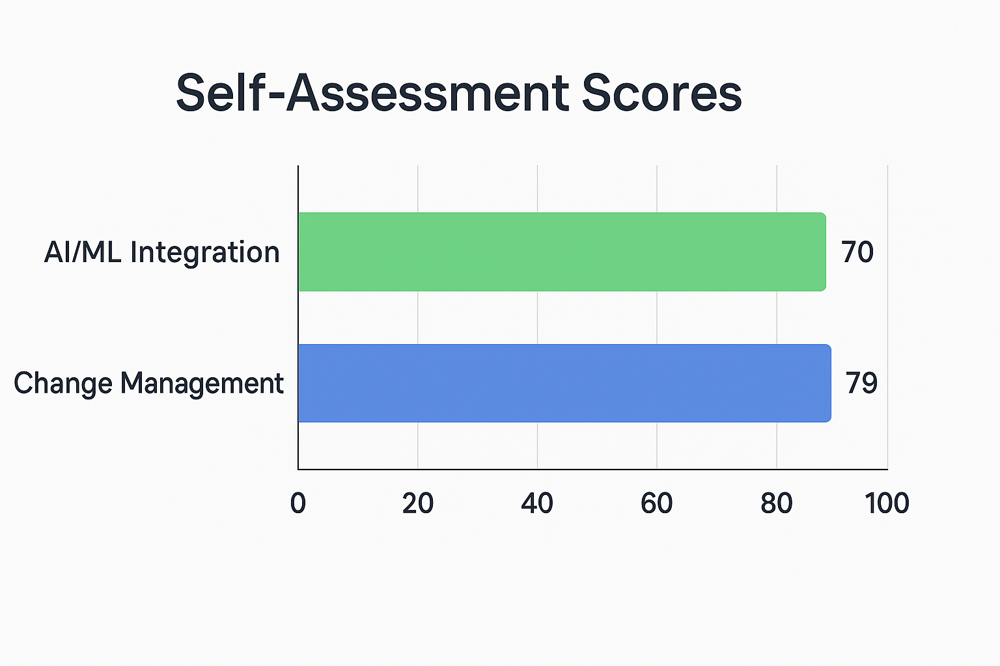

# 🧩 Professional Growth Artifact: AI/ML Integration & Change Leadership Skills

## 📝 Artifact Overview
This artifact showcases two professional self-assessments evaluating my leadership and innovation capabilities:
- **AI/ML Integration Leadership Skills Self-Assessment**
- **Change Management Skills Self-Assessment**

These tools measure my ability to lead technological integration, manage organizational change, and align AI-driven initiatives with business objectives.

---
## 🔍 Key Insights

 

### **AI/ML Integration Assessment Highlights**

| **Category**              | **Score** | **Max** | **Comment**                                                        |
| ------------------------- | --------- | ------- | ------------------------------------------------------------------ |
| Technical Understanding   | 17        | 20      | 🟢 Strong grasp of AI/ML fundamentals and data requirements        |
| Ethical & Responsible AI  | 12        | 20      | 🟢 Excellent awareness of fairness and transparency                |
| Project Management        | 8         | 20      | 🔴 Needs improvement in budgeting and cross-team coordination      |
| Continuous Improvement    | 13        | 20      | 🟡 Consistent learning and improvement in AI practices             |
| Stakeholder Communication | 12        | 20      | 🟡 Clear communicator, could further enhance persuasion strategies |

**Total:** 84 / 120 
---

### **Change Management Skills Assessment Highlights**

| **Category**               | **Score** | **Max** | **Comment**                                                 |
| -------------------------- | --------- | ------- | ----------------------------------------------------------- |
| Communication Skills       | 27        | 30      | 🟢 Excellent clarity, articulation, and feedback ability    |
| Leadership                 | 23        | 25      | 🟢 Strong motivation and delegation capabilities            |
| Problem Solving            | 21        | 25      | 🟢 Analytical and creative approach to resolving challenges |
| Flexibility & Adaptability | 17        | 25      | 🟡 Moderate flexibility, room to strengthen adaptability    |
| Emotional Intelligence     | 18        | 20      | 🟢 High empathy and self-awareness                          |
| Continuous Learning        | 20        | 20      | 🟢 Perfect score – strong commitment to growth              |

**Total:** 198 / 250

---

## 💭 Reflection
These assessments revealed that my strengths lie in **communication, leadership, and ethical awareness**, aligning with my professional goal of becoming a **data-driven engineering leader**.  
They also highlight growth areas such as **AI/ML project budgeting** and **adaptive management**, which I plan to strengthen through further professional development and cross-functional collaboration opportunities.

By analyzing these results, I have become more intentional about integrating **AI ethics**, **data transparency**, and **change-readiness** into my leadership approach.

---

## 🎯 Connection to Professional Goals
This artifact supports my long-term goal of integrating **AI-enhanced process optimization** into **semiconductor and sustainable energy systems engineering**.  
It demonstrates my ability to:
- Lead innovation responsibly  
- Manage cross-functional teams effectively  
- Align technology adoption with organizational culture and values  

As I advance in my career, I will continue to combine **technical expertise** with **transformational leadership** to drive meaningful, data-informed change.

---

## 📂 Included Files
- [AI/ML Integration Leadership Skills Self-Assessment Form](./AI_ML_Integration_Leadership_Skills_Self_Assessment_Form.docx)
- [Change Management Skills Self-Assessment Form](./Change_Management_Skills_Self_Assessment_Form.docx)

---

## 🧠 Keywords
`AI/ML Integration` • `Change Management` • `Leadership` • `Data-Driven Engineering` • `Continuous Improvement` • `Semiconductor Process Optimization`

---
## Added score indicators to tables and chart summary
_Last updated: November 08, 2025_
